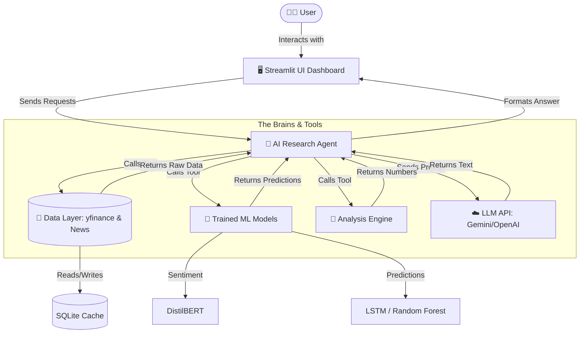
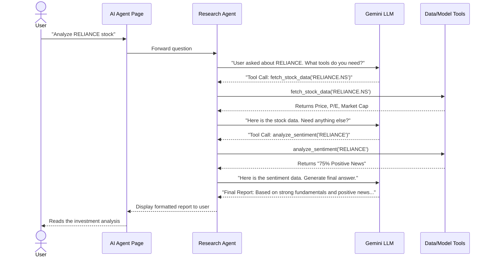
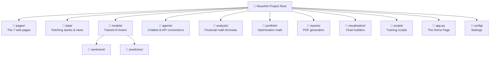

# NiveshAI — AI-Powered Investment Research for Indian Markets

Welcome to **NiveshAI**! If you are wondering what this project is all about, you are in the right place. 

Imagine you have a team of expert financial analysts, mathematicians, and researchers working for you 24/7, summarizing news, crunching numbers, and predicting market trends. NiveshAI is a web application that does exactly that, but instead of human analysts, it uses Artificial Intelligence (AI). 

This document explains everything about NiveshAI in simple, easy-to-understand terms. We will use analogies and avoid complex technical jargon wherever possible.

---

## 🌟 What It Does

NiveshAI is a web app designed specifically for investors in the Indian stock market. It helps users research stocks, analyze trends, and make informed investment decisions using AI.

Think of it as a highly advanced, digital financial advisor. 

The application is divided into **7 main pages**, each serving a specific purpose:

1.  **Home Page (The Dashboard Overview):** This is the front door. It gives you a quick snapshot of the overall market. It shows how major indices like the NIFTY 50 and SENSEX are performing, similar to the headlines on a financial news channel.
2.  **Dashboard (The Deep Dive):** If you want to investigate a specific stock (like Reliance or Tata Consultancy Services), you come here. It shows detailed charts, financial health, and technical indicators.
3.  **AI Research Agent (The Chatbot Advisor):** Imagine chatting with a financial expert. You can ask this AI questions like "How is HDFC Bank doing compared to ICICI Bank?" and it will give you a detailed, data-backed answer.
4.  **Predictions (The Crystal Ball):** Here, we use special Machine Learning models to forecast what might happen to a stock's price in the near future.
5.  **Portfolio Optimizer (The Wealth Strategist):** If you have ₹1,00,000 to invest in 5 different stocks, how much should you put in each? This tool calculates the perfect mix to maximize your returns while minimizing your risk.
6.  **Report Generator (The Document Maker):** Need a professional PDF report on a stock to read later or share with someone? This page generates it for you instantly.
7.  **Settings (The Control Room):** Here you can choose which "AI Brain" you want to use for the Research Agent (like choosing between different expert advisors).

---

## 🏗️ How It Works (Architecture in Layman Terms)

To understand how NiveshAI works, let's break it down into different "departments" of our digital financial firm.

### 1. The Data Layer (The Information Gatherers)
Before AI can make decisions, it needs information. 
*   **Stock Prices:** We use a tool called `yfinance` to grab real-time and historical stock prices from Yahoo Finance. We specifically look for Indian stocks listed on the National Stock Exchange (NSE), which usually end with a `.NS` suffix (like `RELIANCE.NS`).
*   **Financial News:** We fetch the latest news articles using services like NewsAPI and Google News RSS. 
*   **The Filing Cabinet (SQLite Cache):** Fetching data from the internet every single time is slow. So, once we download information, we save a copy in a local digital filing cabinet called a **SQLite database**. Next time we need that info, we check the cabinet first. This makes the app super fast!

### 2. The AI Models (The Brains)
We use two different types of AI brains in this project.

#### A. Trained Models (Our Custom Specialists)
These are models we built and trained ourselves for very specific jobs. Think of them as specialists who only do one thing, but do it incredibly well.
*   **DistilBERT Sentiment Classifier (The News Reader):** 
    *   *What it is:* A language model that reads news headlines.
    *   *What it does:* It tells us the "mood" or "sentiment" of the news—is it **Positive**, **Negative**, or **Neutral**?
    *   *How we made it:* We trained it on a special dataset called "Financial PhraseBank" containing 4,840 financial sentences, so it understands financial language (e.g., "profits fell" is negative).
*   **LSTM Neural Network (The Trend Predictor):**
    *   *What it is:* LSTM stands for **L**ong **S**hort-**T**erm **M**emory. It is a type of AI that is really good at looking at sequences of data over time.
    *   *What it does:* It looks at a stock's price history over the last 60 days, along with 7 technical indicators (like trading volume and momentum), and tries to predict the exact price for tomorrow. 
*   **Random Forest (The Direction Guesser):**
    *   *What it is:* A simpler machine learning model that makes decisions like a flowchart.
    *   *What it does:* Instead of guessing the exact price, it just guesses the direction: Will the stock go **UP**, **DOWN**, or stay **FLAT** tomorrow?

#### B. API Model (The General Manager - Gemini)
This is a massive, highly intelligent AI created by Google, called **Gemini 2.0 Flash**.
*   *What it is:* An LLM (Large Language Model) accessed via an API (Application Programming Interface—a way for our app to talk to Google's servers).
*   *What it does:* This acts as our conversational "Research Agent." It can understand your complex questions in plain English. More importantly, it can use "tools." If you ask about Reliance, the Gemini AI can command our system to fetch Reliance's stock data, run the sentiment classifier on its news, and then write a human-readable report for you based on all that gathered data.

### 3. The Analysis Engine (The Number Crunchers)
This department takes raw numbers and turns them into useful financial metrics.
*   **Fundamental Analysis:** Looks at the core health of a company. It calculates things like P/E ratio (Price-to-Earnings, showing if a stock is expensive), Market Cap (total value of the company), and Revenue.
*   **Technical Analysis:** Looks at stock charts to find patterns. It calculates indicators with fancy names like RSI (Relative Strength Index), MACD, and Bollinger Bands, which help traders decide when to buy or sell.
*   **Risk Scoring:** Calculates how "risky" or bouncy a stock is (volatility) and estimates the maximum amount of money you could potentially lose (Max Drawdown).

### 4. The Portfolio Optimizer (The Strategist)
If you give this tool a list of stocks you want to buy, it uses a famous mathematical concept called **Modern Portfolio Theory (Markowitz)**. It calculates the absolute best way to divide your money among those stocks so that you get the highest possible return for the level of risk you are comfortable taking. It displays this visually on a chart called the "Efficient Frontier."

### 5. The UI (The Storefront)
This is what you actually see and interact with.
*   *What it is:* A multi-page web application built using a tool called **Streamlit**.
*   *Look and Feel:* It uses a "dark glassmorphism theme," which means it has a sleek, modern, dark background with semi-transparent, frosted-glass-like panels.
*   *Charts:* It uses **Plotly** to draw interactive charts that you can zoom in on and hover over for details.

### 6. Tech Stack (The Tools We Used)
For the technical folks, here are the main tools used to build this:
*   **Python 3.10:** The main programming language.
*   **Streamlit:** For building the web interface.
*   **PyTorch & scikit-learn:** For building and training our custom AI models.
*   **Hugging Face Transformers:** The library used for our DistilBERT news reader.
*   **Plotly:** For interactive charts.
*   **yfinance & NewsAPI:** For getting stock data and news.
*   **Google Gemini API:** The brain for our conversational agent.
*   **scipy:** For complex math in the portfolio optimizer.
*   **fpdf2:** For creating PDF reports.
*   **SQLite:** The local database for fast data caching.

---

## 🇮🇳 Indian Market Focus (Local Expertise)

NiveshAI isn't generic; it is tailor-made for India.
*   **The Universe:** It focuses on the **NIFTY 500**, a database of the top 500 companies in India.
*   **Tickers:** It is programmed to understand NSE (National Stock Exchange) tickers.
*   **Currency:** Everything is formatted in Indian Rupees (₹) and uses the Indian numbering system (Lakhs and Crores).
*   **News:** It specifically targets Indian financial news sources.
*   **Sectors:** It understands the Indian corporate landscape, categorizing companies into sectors like IT, Banking, Pharma, FMCG (Fast-Moving Consumer Goods), and Auto.

---

## 📁 Project Structure (How Things are Organized)

The project consists of 60 different files organized into 15 folders. Keeping things organized is crucial for a project this large.

Here are the key folders:
*   `pages/`: Contains the 7 files that make up the different screens of the web app.
*   `data/`: Scripts responsible for fetching stock numbers and news articles.
*   `models/`: Contains our custom-trained ML models (Sentiment and Prediction).
*   `agents/`: Contains the code for the conversational AI and the connections to different LLM providers (like Gemini).
*   `analysis/`: The mathematical formulas for fundamental, technical, and risk analysis.
*   `portfolio/`: The math for optimizing your investments.
*   `reports/`: The code that generates the PDFs.
*   `visualization/`: The code that draws the beautiful charts.
*   `scripts/`: Utility scripts, mostly used for training the AI models.

---

## 🎓 How Models are Trained (Teaching the AI)

Our custom models didn't start out smart; we had to teach them. 

*   **Sentiment Model (DistilBERT):** We gave it 4,840 sentences from the "Financial PhraseBank" and told it which ones were positive, negative, or neutral. By looking at these examples, it learned to figure it out on its own.
*   **LSTM & Random Forest (Price Predictors):** We fed these models 2 years of daily historical data for the top 50 Indian companies. It studied the patterns (how volume and technical indicators relate to price changes) to learn how to predict the next day's movement.

**The Training Process:** Training AI requires a lot of mathematical calculations. Doing this on a normal computer processor (CPU) would take forever. So, we ran the training process on a powerful Graphics Processing Unit (**RTX 4050 GPU**). This allowed us to train all the models in just about 1 to 2 hours.

---

## 🔄 Multi-Model Provider System (Choosing Your Brain)

While Google's Gemini is our default "General Manager" AI because it's powerful and offers a generous free tier, NiveshAI doesn't lock you in.

In the **Settings** page, users can switch the "brain" of the Research Agent. If a user has their own API keys (passwords to access other AI services), they can plug them in and use:
*   **OpenAI** (The makers of ChatGPT)
*   **Groq** (Known for being incredibly fast)
*   **Anthropic** (Makers of Claude, known for detailed analysis)

The app even features a usage tracker with progress bars so you can see how many questions you've asked today and ensure you don't go over your free limits!

---
<br>

# 🗺️ System Diagrams

To help visualize how all these pieces fit together, here are some diagrams.

### 1. Overall System Architecture
This shows the flow of information. You click a button on the UI, the Agent figures out what to do, asks the models and data sources for help, and sends the answer back to you.



### 2. How the AI Agent Processes a Question
This sequence diagram shows step-by-step what happens when you ask the chatbot a question like "Should I buy Reliance?"



### 3. Training Pipeline
This shows the 1-2 hour process of teaching our custom models before the app is ready to use.

```mermaid
flowchart LR
    subgraph Data Sources
        NewsData[Financial PhraseBank Dataset]
        StockData[2 Years NIFTY 50 Historical Data]
    end
    
    subgraph Training on GPU (RTX 4050)
        DistilBERT[DistilBERT Model]
        LSTM[LSTM Neural Network]
        RF[Random Forest]
    end
    
    subgraph Saved Outputs
        Model1[(sentiment_model.pt)]
        Model2[(lstm_model.pt)]
        Model3[(rf_model.pkl)]
    end
    
    NewsData -->|Train on text| DistilBERT
    StockData -->|Train on numbers| LSTM
    StockData -->|Train on numbers| RF
    
    DistilBERT --> Model1
    LSTM --> Model2
    RF --> Model3
    
    Model1 -.-> |Loaded into| App[NiveshAI App]
    Model2 -.-> |Loaded into| App
    Model3 -.-> |Loaded into| App
```

### 4. Project Folder Structure
A visual representation of the 15 directories that keep the project organized.


